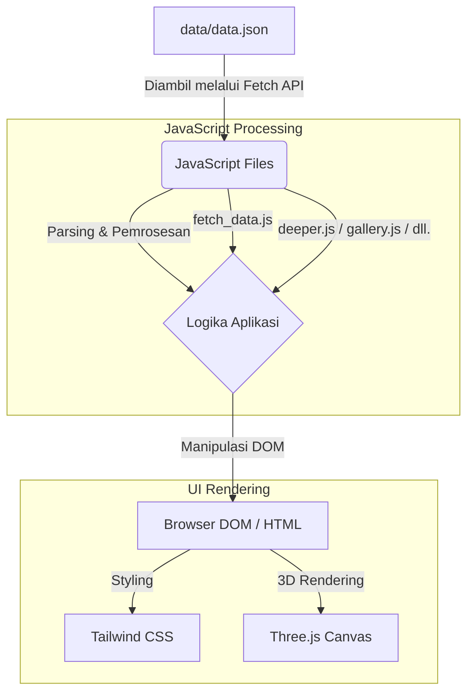

# Arsitektur Proyek Web UTS

Dokumen ini menjelaskan arsitektur teknis, alur data, dan keputusan teknologi (tech stack) yang digunakan dalam proyek ini.

## Alur Data (Data Flow Diagram)

Diagram berikut mengilustrasikan bagaimana data mengalir dari sumber data hingga ditampilkan di halaman web (DOM).

### Penjelasan Alur:

1. **Sumber Data**: Data terpusat disimpan dalam `data/data.json`. Data ini mungkin merupakan hasil ekstraksi dari skrip ETL (`data/etl_redfox.py`).
2. **Pengambilan Data (Fetch)**: Skrip JavaScript (seperti `fetch_data.js`) menggunakan Fetch API untuk mengambil file JSON tersebut masuk ke dalam memori aplikasi saat halaman dimuat.
3. **Pemrosesan Data**: Data JSON di-_parse_ ke dalam objek JavaScript. Skrip-skrip spesifik halaman (seperti `deeper.js`, `gallery.js`, `timeline.js`) menggunakan data ini sesuai kebutuhan masing-masing halaman.
4. **Manipulasi DOM**: Data yang telah diproses kemudian disuntikkan (injected) secara dinamis ke dalam elemen-elemen HTML (DOM) untuk ditampilkan kepada pengguna.

## Tech Stack & Keputusan Teknologi (Why We Chose This)

Proyek ini dibangun menggunakan kombinasi teknologi berikut:

### 1. **Vanilla JavaScript (ES6+)**

- **Mengapa**: Untuk proyek berskala kecil hingga menengah, penggunaan framework raksasa seperti React atau Vue mungkin _overkill_ dan menambah kompleksitas yang tidak perlu. Vanilla JS modern sudah sangat kuat untuk melakukan manipulasi DOM, pengaturan antarmuka, dan _fetching_ data.
- **Peran**: Menangani interaktivitas, memproses data dari JSON, animasi, dan manipulasi elemen di layar.

### 2. **Tailwind CSS**

- **Mengapa**: Tailwind adalah CSS _framework_ berbasis _utility-first_ yang sangat mempercepat proses styling. Dengan Tailwind, kita tidak perlu sering-sering berpindah antara file HTML dan CSS, serta memastikan konsistensi desain yang tinggi. Tailwind juga mendukung _purging_ (pembersihan) CSS yang tidak terpakai (dikonfigurasi dengan PostCSS/Tailwind config), sehingga ukuran file web jadi jauh lebih kecil dan halaman lebih cepat dimuat.
- **Peran**: Pembentuk layout, warna, tipografi, serta desain responsif di seluruh halaman HTML.

### 3. **JSON (JavaScript Object Notation)**

- **Mengapa**: Sebagai format pertukaran data, JSON sangat ringan, mudah dibaca, dan secara alami didukung/diproses dengan sangat cepat oleh JavaScript tanpa perlu konversi yang rumit. Data tersentralisasi di `data.json` membuat update konten lebih terorganisir, tidak perlu mengubah file HTML satu per satu.
- **Peran**: Bertindak sebagai "database lokal" berformat _flat file_ yang menyimpan informasi konten-konten galeri, timeline, text content, dll.

### 4. **HTML5**

- **Mengapa**: Fondasi wajib bagi struktur website mana pun. Penggunaan berbagai file HTML statis (`pages/deeper.html`, dll.) di-_link_ sedemikian rupa adalah pendekatan Multi-Page Application (MPA) tradisional namun solid dan _SEO-friendly_.
- **Peran**: Menggambarkan struktur semantik kerangka dasar aplikasi web.

### 5. **Three.js (diindikasikan dengan `three-setup.js`)**

- **Mengapa**: WebGL native sangat sulit, Three.js sangat mempermudah proses pembuatan visual dan animasi 3D di dalam browser. Jika proyek ini membahas lingkungan alam (mengacu pada red fox, timeline), elemen 3D sangat bagus secara estetik untuk meningkatkan _engagement_ dan memberikan visual interaktif.
- **Peran**: Mem-build dan melakukan proses _rendering_ atas model 3D (`assets/models/`) agar dapat diinteraksikan pengguna di canvas HTML.

### 6. **Python (ETL Script - `etl_redfox.py`)**

- **Mengapa**: Python punya ekosistem terbaik untuk Web Scraping dan Data Processing. Sangat efisien untuk membangun _pipeline_ ETL (Extract, Transform, Load) jika data-data rubah merah (`red fox`) dikumpulkan dari API eksternal, web scraping, atau database mentah lainnya.
- **Peran**: Alat bantu (di belakang layar) untuk membentuk dan membersihkan data mentah hingga menjadi bentuk `data.json` bersih yang akhirnya disajikan di frontend.
